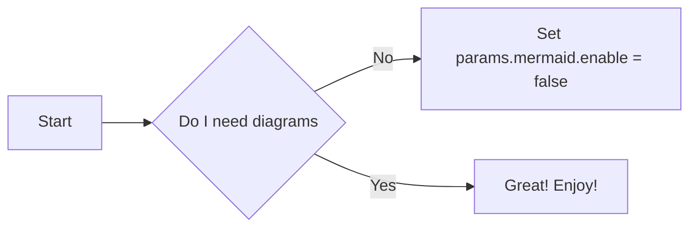
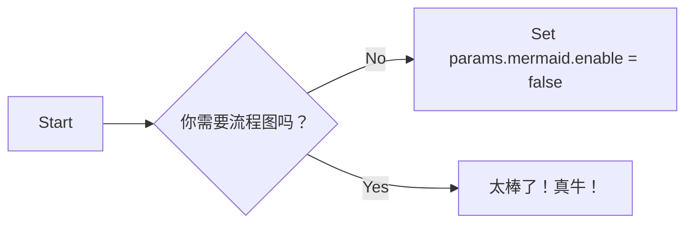

针对本项目的特点，需要在样式和功能上做进一步调整。

## 更改显示样式

### 更改颜色

快速更改全站的配色，可添加项目变量的 SCSS 文件（在项目的根目录中添加） assets/scss/_variables_project.scss。如下代码可更改主副颜色

```css

$primary: #390040;
$secondary: #A23B72;
````
如果需要添加圆角和渐变背景可以使用如下语法：

```css
$enable-gradients: true;
$enable-rounded: true;
$enable-shadows: true;
```

### 更改字体

这个主题使用了 google 的 Open Sans 作为主字体，如果要禁用谷歌字体而使用系统字体，可以在 assets/scss/_variables_project.scss 中设置 SCSS 变量：

```css

$td-enable-google-fonts: false;
```
{}
特别是在内网部署，一定要禁用谷歌字体
{}

### CSS 附加功能

本主题主要使用了 bootstrap 的css框架，仅添加了非常少量的自定义 class，比较方便使用的有如下2个，可以很方便的改变背景和文本的颜色：

- .-bg-<color>
- .-text-<color>

The value of <color> can be any of the color names, primary, white, dark, warning, light, success, 300, blue, orange etc.

When you use .-bg-<color>, the text colors will be adjusted to get proper contrast:

```html
<div class="-bg-primary p-3 display-4">Background: Primary</div>
<div class="-bg-200 p-3 display-4">Background: Gray 200</div>
```
<div class="-bg-primary p-3 display-4">Background: Primary</div>
<div class="-bg-200 p-3 display-4">Background: Gray 200</div>

## 使用 Mermaid 显示图表

Mermaid 是一个 JavaScript 库，用来在浏览器中渲染由文本定义的图表，它可以生成不同类型的图表，包括：流程图，顺序图，类图，状态图，ER图，用户旅程图，甘特图和饼图。

例如，下面是一个简单流程图的例子：

````

````

自动渲染成下图：



To enable/disable Mermaid, update config.toml:

```toml
[params.mermaid]
enable = true
```
You can also update settings for Mermaid, such as themes, padding, etc:

```toml
[params.mermaid]
enable = true
theme = "neutral"

[params.mermaid.flowchart]
diagramPadding = 6
```

{}
这里要注意 mermaid 需要的js文件是否已经本地化，默认是使用了互联网上的地址，需要把它本地化！！！
将 popper jquery bootstrap mermaid lunr 的js文件下载到 /static 目录下，修改文件 themes\docsy\layouts\partials\scripts.html ，将5个文件的src部分修改一下。还有 themes\docsy\layouts\partials\head.html 文件依此办理。
{}

## 附加模板功能

### Add code to head or before body end
If you need to add some code (CSS import or similar) to the head section on every page, add a partial to your project:

layouts/partials/hooks/head-end.html
And add the code you need in that file. Your partial code is automatically included at the end of the theme partial head.html (the theme version of head-end.html is empty):

Similar, if you want to add some code right before the body end, create your own version of the following file:

layouts/partials/hooks/body-end.html
Any code in this file is included automatically at the end of the theme partial scripts.html.

Both head.html and scripts.html are then used to build Docsy’s base page layout, which is used by all the other page templates:

```html
<!doctype html>
<html lang="{{ .Site.Language.Lang }}" class="no-js">
  <head>
    {{ partial "head.html" . }}
  </head>
  <body class="td-{{ .Kind }}">
    <header>
      {{ partial "navbar.html" . }}
    </header>
    <div class="container-fluid td-default td-outer">
      <main role="main" class="td-main">
        {{ block "main" . }}{{ end }}
      </main>
      {{ partial "footer.html" . }}
    </div>
    {{ partialCached "scripts.html" . }}
  </body>
</html>
```

## 导航和搜索

### 顶级菜单

顶级（Top-level）菜单是显示在全站顶部导航栏上的菜单，需要使用 main menu 变量，hugo 使用 .Site.Menus 站点变量来表示 main menu ，这个变量可以在站点的 config.toml 配置文件中定义，或者在每个页面的 front matter 定义，如果在页面定义，只能是 _index.md 或 _index.html。

在页面中：

````
---
title: "Docsy Documentation"
linkTitle: "Documentation"
menu:
  main:
    weight: 20
---

````

菜单在顶部的排列顺序是靠“weight"值确定的，如果希望在顶部导航菜单添加一个外部链接，可以在 config.toml 中添加，并设置合适的 weight 值。

```toml
[[menu.main]]
    name = "GitHub"
    weight = 50
    url = "https://github.com/google/docsy/"

```

**版本选择下拉菜单**
config.toml 文件中添加 [params.versions] 参数，会在顶部导航菜单添加一个版本选择的下拉菜单

### 左侧导航菜单 Section menu

一般情况下，左侧导航菜单是根据 content 文件夹中的内容自动生成的，按照 weight 值排序（如果 weight 值不存在，会按照页面的 date 值），标题会使用 linkTitle （或者 title），如果一个 section 子文件夹有除了 _index.md 或者 _index.html 的页面，这些页面会显示为一个子菜单。例如下面这个页面的元数据：

````
---
title: "Navigation and Search"
linkTitle: "Navigation and Search"
date: 2017-01-05
weight: 3
description: >
    Customize site navigation and search for your Docsy site.
---
````
如果需要在导航菜单中隐藏这个页面，可以在它的 front matter 中设置 `toc_hide:true`.
如果文档很多，层级很深，不想在导航中全部显示，可以在站点的 config.toml 中设置 `ui.sidebar_menu_compact = true`

### 面包屑导航 Breadcrumb navigation

在站点的 config.toml 文件中设置`ui.breadcrumb_disable = true`


### 设置站点的搜索引擎

Docsy 提供了多种的搜索引擎选项

- Google Custom Search Engine (GCSE)，默认选项，需要连接互联网，由 google 提供服务，不建议选用。
- Algolia DocSearch， 需要连接互联网，不推荐。
- Local search with Lunr, 使用 javascript 进行索引，不需要联网，推荐使用。

使用哪种搜索引擎，需要在 config.toml 文件中配置

#### 搜索框的显示与关闭

默认会在顶部导航栏显示搜索框，可以在 config.toml 进行关闭或打开的设置
```toml
sidebar_search_disable = true
```

#### 使用 lunr 进行本地搜索

打开 lunr 的配置：

1. 在 config.toml 中启用本地搜索
   ```toml
   # Enable local search
   offlineSearch = true
   ```
2. 在 config.toml 中删除GCSE ID 的设置并关闭 Algolia 的搜索

完成这两步，本地搜索就启用了

#### 更改本地搜索结果的摘要长度
```toml
#Enable offline search with Lunr.js
offlineSearch = true
offlineSearchSummaryLength = 200
```

#### 更改本地搜索结果的最大数量
```toml
#Enable offline search with Lunr.js
offlineSearch = true
offlineSearchMaxResults = 25
```

#### 更改本地搜索结果显示框的宽度

在文件 assets/scss/_variables_project.scss 修改
```css

body {
    .popover.offline-search-result {
        max-width: 460px;
    }
}
```

#### 将页面从本地搜索结果中排除

需在该页面的 front matter 处设置`exclude_search: true`
```toml
---
title: "Index"
weight: 10
exclude_search: true
---
```

## Logos 和 图片

在项目中添加或者定制化 logo, icons, images

### 添加自己的 logo

logo 文件的默认位置是 `assets/icons/logo.svg`，如果你想要 logo ，可以设置 `navbar_logo` 为 `false`
logo 的css定义在 _nav.scss
```css
svg {
    display: inline-block;
    margin: 0 10px;
    height: 30px;
}
```
如果 logo 显示不正常（特别是 svg 文件），可以覆盖上面的 css ，或者检查 svg 文件是否指定的 width 或 height ，如果有指定，应该清除。


### 添加自定义的 favicons

可以通过网站 http://cthedot.de/icongen 生成系列自己的 favicons，放到文件夹`static/favicons`下。也可以通过修改文件`layouts/partials/favicons.html`来自定义。

### 添加图片

#### 项目首页（引导页）

使用 `block/cover` shortcode 可以很方便的添加全屏的封面图片作为引导页。引导页位置 `content/_index.html`，背景图片默认为 `content/en/featured-background.jpg`，通过设置 `height` 参数来调整图片的大小：

````html


...


````

```html

...

```

#### 其他页面

在其他页面添加图片可以使用 `imgproc` shortcode，或者使用 Markdown 或者 HTML 图片标签，把需要的图片放入项目的 `static` 文件夹，可以参考“添加静态内容”部分。 

### 添加其他静态内容

你可能想把一些不是 hugo 生成的内容添加到你的项目，比如已经有一些 pdf 或者 html 文件。这些文件可以放到`static`文件夹，当站点部署以后，`static`文件夹下的内容会被当做站点的根目录内容，比如你添加的内容在`static/somedoc/doc/`，用户访问时的 url 会是`http://{server-url}/somedoc/doc/`，如果需要将此处的内容链接到站点内的其他页面，可以使用 `/somedoc/doc/{file name}`。

比如有些图片、视频等也可以照此处理。